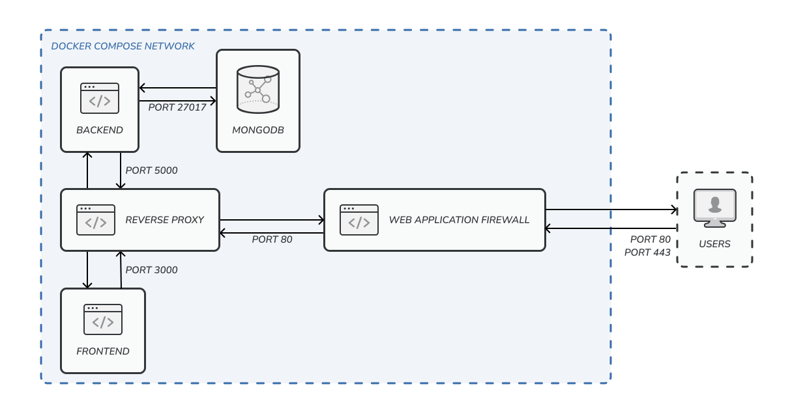

<div style="text-align: center;">
  
</div>

# Firewall Fighters
This is a semester project for the course Computer Network Security Principles (CNSP) at the University of Zurich in the year 2024. In the first phase we implemented a calendar application and in the second phase we added security features to it. The third and last step is to perform a penetration test and a security assessment on another application.

## Overview
The design of our calendar application is based on a modular, containerized architecture, which provides flexibility and scalability for further development. Our main focus has been to implement the essential features of a calendar application, using an existing code base as our starting point, while structuring the project to allow for seamless integration of additional functionalities, particularly in security, as required by the Challenge Task.

Our calendar app leverages a three-tier architecture: frontend, backend, and database, each encapsulated within its own Docker container. Furthermore, the security features are in their separate container as well. This setup promotes a clean separation of concerns and aligns with modern practices, ensuring that our application is consistent across development and deployment environments.

<div style="text-align: center;">
  
</div>

### Frontend

The frontend is built using React \cite{react} and designed for a user-friendly experience. It includes interfaces for calendar views—monthly, weekly, and daily—allowing users to easily manage events and navigate between views. React Router \cite{react-router} handles client-side routing, enabling seamless navigation across different components. Redux \cite{redux} is used for efficient state management, which helps synchronize data across the application, especially useful in handling user sessions.

The communication between the frontend and backend happens via Axios \cite{axios}, making it easy to issue HTTP requests for CRUD operations on calendar events. To optimize user experience, we implemented visual cues and color-coded categories, which help users differentiate between tasks. Users can share the calendars, based on username, which makes it possible to collaborate effectively. 

### Backend and API
The backend is built with Node.js \cite{nodejs} and Express \cite{express}, structured to serve as the API layer for handling user authentication, event management, and calendar sharing. JWT \cite{JWT} is used for secure session management, which provides secure token-based authentication and ensures that user sessions remain protected. Endpoints are RESTful \cite{RESTful}, making the backend highly extensible and easy to integrate with various frontend components.

One of the key backend functions is handling event-sharing requests, where users can invite others to collaborate on specific calendars. This feature relies on a permission-checking mechanism to ensure users can only access calendars they are authorized to view.

### Database

We use MongoDB \cite{mongodb} for storing user data, calendar events, and permissions related to event sharing. Our schema is designed to be scalable and includes key collections such as users, events, and calendars, each containing relevant fields for optimized querying. By using a document-based NoSQL structure, we can handle a wide range of data types, enabling future modifications without extensive restructuring.


### Containerization

Our application’s Docker configuration ensures a consistent environment, with each component—frontend, backend, database, and security features—running in separate containers. Docker Compose orchestrates these services, simplifying the setup and maintenance. The frontend container exposes port 3000, the backend runs on port 5000, and MongoDB is accessible on port 27017, providing clear separation and controlled access between services. This design allows us to manage, scale, and deploy the application seamlessly, both locally and in production.

## Calendar Application Deployment Guide

 To deploy and run the calendar application, we recommend using the latest versions of [Docker](https://www.docker.com) and [Docker Compose](https://docs.docker.com/compose/) to ensure compatibility with modern features, improved performance, and better security. The application has been built and tested on the following versions:

- **Docker Engine**: `26.1.1`
- **Docker Compose**: `v2.27.0`

### Production

Ensure no other services are running on ports `3000` and `80`. Then, start the application with all its containers by executing the following commands in the project directory:

```bash
docker-compose build
docker-compose up -d
```

### Development

#### Prerequisites
- Docker and Docker Compose installed
- Node.js (latest stable version)
- npm (comes with Node.js)

Verify Node.js and npm installation:

```
node -v
npm -v
```

#### Frontend Development
To develop either the frontend or the backend, you can use different commands to run the Docker containers in development mode. To develop the frontend, you can run the following commands in terminal:

```bash
docker-compose down
docker-compose build
docker-compose up -d
```

This will start the Docker containers as usual, but to ensure that the changes in the frontend take effect, you will also need to run the following command. Running this will open a new frontend service, but you will need to use the one from the Docker Compose network to work seamlessly.

```
cd frontend
npm run start
```

To run `npm run start` and successfully launch a React application, ensure the latest stable version of Node.js is installed, which includes npm (Node Package Manager). Verify installation by running:

```
node -v
npm -v
```

#### Backend Development

To develop the backend run the following commands:

```
docker-compose down
docker-composer build
docker-compose -f docker-compose.yml -f docker-compose.dev.yml up -d
```

Additionally you have to run the following command:

```
cd backend
npm run dev
```

## Security Features

| #   | Feature                              | Description                                         |
| --- | ------------------------------------ | --------------------------------------------------- |
| 1   | Minimize attack surface              | Prevent direct access to backend and database.      |
| 2   | Web Application Firewall (WAF)       | ModSecurity with Core Rule Set.                     |
| 3   | Password Hashing                     | Implemented with bcrypt in the backend.             |
| 4   | Password complexity                  | Implemented a check in the backend.                 |
| 5   | Limiting the Number of Failed Logins | Implemented a check in the backend.                 |
| 6   | Prevent NoSQL Injection              | Mongoose's query methods.                           |
| 7   | Input validation                     | Frontend validation module.                         |
| 8   | No use of default passwords          | Changed default user and password for all services. |

## Acknowledgement

As a starting point for this challenge task we used [Joey Kim](http://www.josephikim.com)'s [React Calendar](https://github.com/josephikim/react-calendar).

